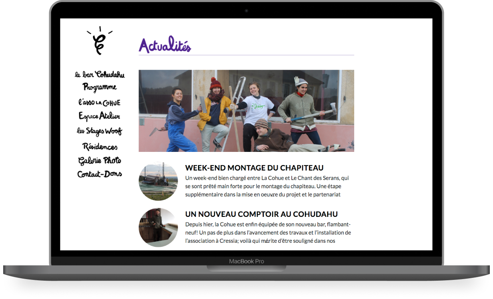

This is a website design and development for La Cohue, an association based in Cressia, France and focused on cultural activities. The website goes along with the opening of their bar, Le Cohudahu and its purpose is to give information about the association, the bar and the many different cultural activities they organize.

**A quick design overview is available on behance**:  
https://www.behance.net/gallery/51761467/Cohudahu-Web-design
